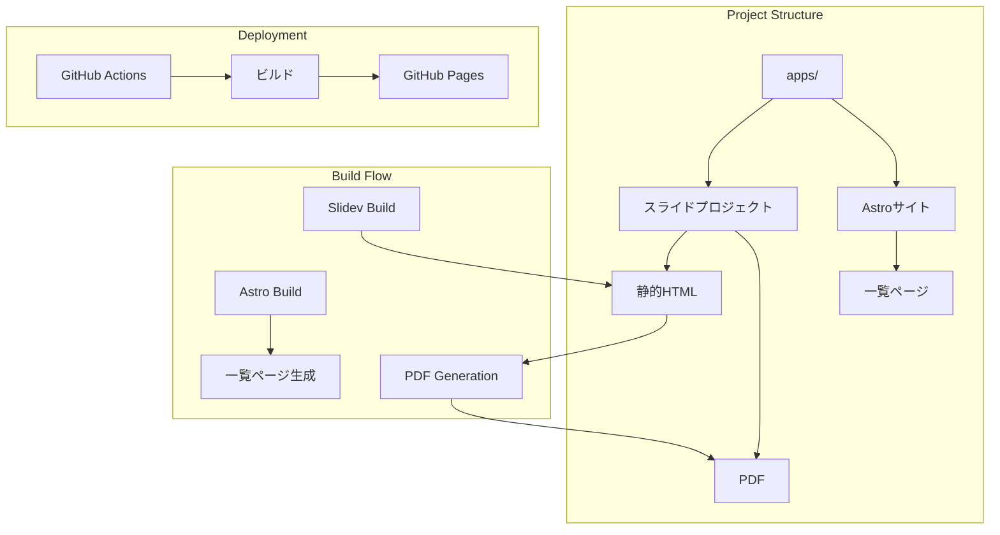

# System Patterns: Slidev Gallery

## Architecture Overview


## Key Design Patterns

### 1. ファイル構造パターン
```
project-root/
├─ apps/
│  ├─ slide-project-1/
│  │  ├─ slides.md（メタ情報を含むフロントマター）
│  │  ├─ dist/（ビルド後のHTML）
│  │  └─ pdf/（生成されたPDF）
│  └─ astro-site/
│     └─ src/
│         └─ pages/
│             └─ index.astro
```

### 2. メタ情報管理パターン
- フロントマターベースの情報管理
- 自動抽出による一覧ページへの反映
- スライド情報の一元管理

### 3. ビルドパターン
1. スライドビルドフロー
   - Slidevによる静的HTML生成
   - Puppeteer/PlaywrightによるPDF生成
2. Astroビルドフロー
   - メタ情報の収集・パース
   - 一覧ページの生成
   - リンク構造の構築

### 4. デプロイメントパターン
- GitHub Actionsによる自動化
- 差分検出によるビルド
- GitHub Pagesへの自動デプロイ

## Technical Decisions

### 1. フレームワーク選択
- Astro: 静的サイト生成に最適
- Slidev: Markdownベースのスライド作成

### 2. PDF生成戦略
- Puppeteer/Playwright採用
- HTMLからPDFへの変換を自動化
- 品質担保のための最適化

### 3. ビルド自動化
- GitHub Actions採用
- マルチステップビルドプロセス
- 依存関係の適切な管理
